  

  

  
  &nbsp;&nbsp;&nbsp;&nbsp;
  

*I'm a Software Developer who enjoys turning ideas into real applications.*

*I mainly work with Java, Spring Boot and Flutter, and I also enjoy the visual side of development, especially UI design.*

*I'm currently learning more about AI and automation, and exploring how I can use them in my projects and development workflow.*

<table>
  <tbody>
    <tr>
      <td>Languages</td>
      <td>
        
        
        
        
        
        
      </td>
    </tr>
    <tr>
      <td>Frontend & Mobile</td>
      <td>
        
        
        
      </td>
    </tr>
    <tr>
      <td>Backend</td>
      <td>
        
        
      </td>
    </tr>
    <tr>
      <td>Databases</td>
      <td>
        
        
        
      </td>
    </tr>
    <tr>
      <td>Tools & Platforms</td>
      <td>
        
        
        
        
        
        
        
      </td>
    </tr>
  </tbody>
</table>
